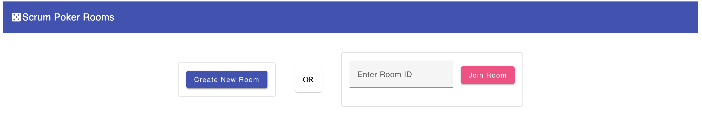
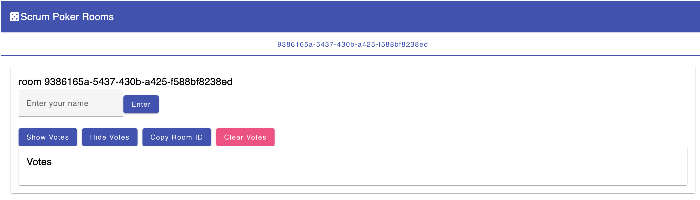
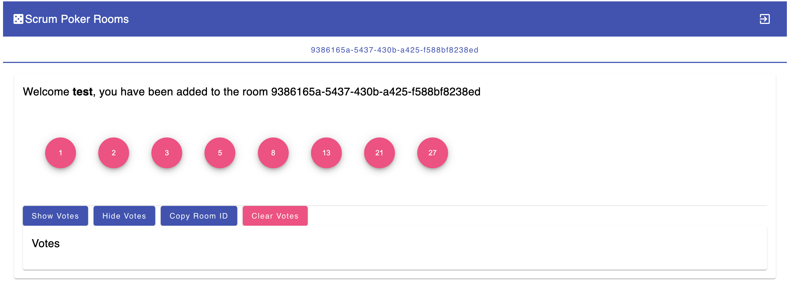

# ScrumPoker

ScrumPoker is a web application designed to facilitate agile estimation sessions using the Scrum Poker technique. This project includes both an Angular frontend and a Node.js backend, and it is built to be deployed using Docker.

## Table of Contents

- [About](#about)
- [Features](#features)
- [Technologies](#technologies)
- [Setup](#setup)
- [Development](#development)
- [Build](#build)
- [Running Tests](#running-tests)
- [Deployment](#deployment)
- [Further Help](#further-help)

## About

ScrumPoker is a tool used by agile teams to estimate the effort required to complete tasks. It allows team members to vote on the complexity of tasks anonymously, ensuring that all voices are heard and that estimates are unbiased.

## Features

- Create and join Scrum Poker rooms
- Real-time voting and results display
- Responsive design for use on various devices
- Secure and scalable architecture

## Technologies

- **Frontend**: Angular, Angular Material
- **Backend**: Node.js, Express, Socket.io
- **Database**: (Specify if any)
- **Containerization**: Docker, Docker Compose
- **Deployment**: Azure Container Registry, Azure Container Apps

## Setup

### Prerequisites

- Node.js (version 18.x or later)
- Angular CLI (version 18.2.11 or later)
- Docker

### Installation

1. Clone the repository:
   ```sh
   git clone https://github.com/your-username/scrum-poker.git
   cd scrum-poker
   ```
2. Install dependencies for both frontend and backend:
   npm install

### Development

Running the Angular Frontend

1. Navigate to the project directory:

   npm run start-angular

2. Open your browser and navigate to http://localhost:4200.

Running the Node.js Backend

1. Navigate to the project directory:

   npm run start-server

2. The backend server will be running on http://localhost:3000.

### Build

Building the Angular Application

1. Navigate to the project directory:

2. Build the Angular application:

   npm run build-angular

Building the Docker Image

1. Navigate to the project directory:

2. Build the Docker image:

   docker build -t xxxx/scrum-poker:latest .

3. Push the Docker image to Azure Container Registry:

   docker push xxxx/scrum-poker:latest

4. Navigate to the project directory:

### Screeenshots




